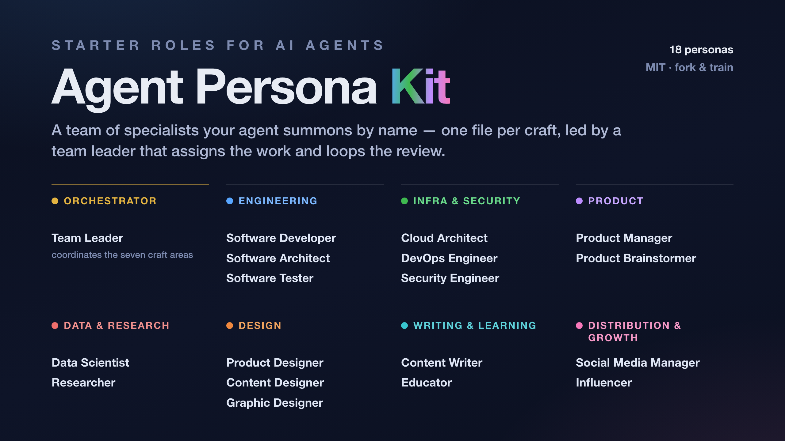

<p align="center">
  
</p>

# Agent Persona Kit

A good agent isn't one giant prompt — it's a small team of specialists you can
summon by name. This is a starter set of those specialists: one Markdown file
per craft, each a short, opinionated statement of how that role works. Fork it
and pull in the specialists a task needs.

Works with any agent that can read a file: Claude Code, Cursor, an SDK loop, or
a plain system prompt. The personas are just Markdown; nothing here is
tool-specific.

## Quickstart

1. **Fork or clone** the repo and point your agent at the folder so it can read the personas:
   [github.com/srivardhanjalan/agent-persona-kit](https://github.com/srivardhanjalan/agent-persona-kit)
2. **Then just ask — in plain language.** No prompt-engineering; name the specialist and hand over the task:
   > Consult the product manager and pressure-test this feature.

   > Bring in the graphic designer.
3. **Stack several for a job that spans crafts:**
   - a blog post → content writer + content designer
   - a deploy → devops engineer + cloud architect
   - anything shipping to the public → also the security engineer

## Why personas

The content writer knows what makes a title work; the security engineer assumes
the repo goes public tomorrow; the product manager decides what earns its way
in. That is what a persona buys you: durable context, loaded on demand, so
you're not re-explaining your bar every session.

You don't engineer the prompt; the persona primes the agent. Reach for the
product manager and it starts interrogating who the user really is; reach for
the graphic designer and it finally has opinions on hierarchy and whitespace.

These files are deliberately **bare-bones** — the opinionated kernel of each
craft, nothing project-specific baked in. They're seeds, not finished playbooks.
You grow them.

## The roster

13 personas across four work areas. Each is self-contained — fork, drop, or
rewrite one without touching the others.

### Engineering

| Persona | Owns |
|---|---|
| [Software Developer](software-developer.md) | code, verification, deleting what isn't earning its place |
| [Software Architect](software-architect.md) | boundaries, contracts, module design |

### Infrastructure & Security

| Persona | Owns |
|---|---|
| [Cloud Architect](cloud-architect.md) | infrastructure topology, cost, teardown |
| [DevOps Engineer](devops-engineer.md) | pipelines, deploys, gates |
| [Security Engineer](security-engineer.md) | secrets, auth, exposure discipline |

### Product

| Persona | Owns |
|---|---|
| [Product Manager](product-manager.md) | scope, sequencing, audience value |
| [Product Designer](product-designer.md) | UX, interaction, design systems |
| [Product Brainstormer](product-brainstormer.md) | idea generation, research, validation |

### Content & Communication

| Persona | Owns |
|---|---|
| [Content Writer](content-writer.md) | prose, titles, voice |
| [Content Designer](content-designer.md) | covers, imagery, visual publishing |
| [Graphic Designer](graphic-designer.md) | composition, grid, type, optical detail |
| [Social Media Manager](social-media-manager.md) | distribution, platform mechanics |
| [Educator](educator.md) | tutorials, curriculum, learner experience |

## What a persona looks like

Each file is short: an identity line and a handful of core principles. In full,
[`product-manager.md`](product-manager.md):

```markdown
# Product Manager

Decides what earns its way in — and when.

## Core principles
- YAGNI is product law: features, config, and content ship when something consumes them, never in anticipation.
- Sequence for narrative and dependency: finish and verify one release before the next; each ends in a state a user can hold.
- Costs are stated plainly — surprise costs destroy trust.
- The audience designs with you: reader questions and comments are requirements intake.
- Series and brand consistency compound: naming, voice, and house style are product surface, not decoration.
```

## How to train them

Personas earn their weight by learning. When a project teaches you something — a
rule, a correction, a practice that worked — add it to the persona it belongs
to, in that craft's voice, with the reasoning that earned it.

Keep one line clear: **craft rules go in the persona; project rules don't.**
"Titles must carry meaning" is craft, and it belongs here. "Every release ships
a changelog at `docs/CHANGELOG.md`" is workflow; it belongs in your project's
own config, not a persona you reuse across projects.

## License

MIT — see [LICENSE](LICENSE). Fork it, adapt it, make it yours.
