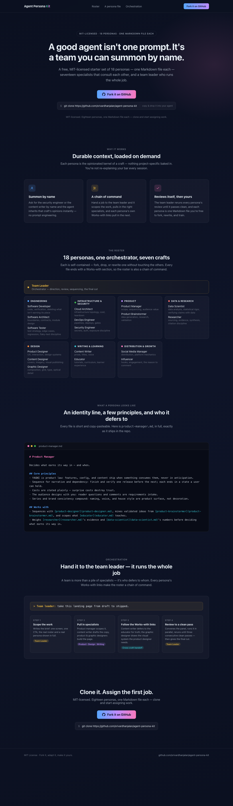
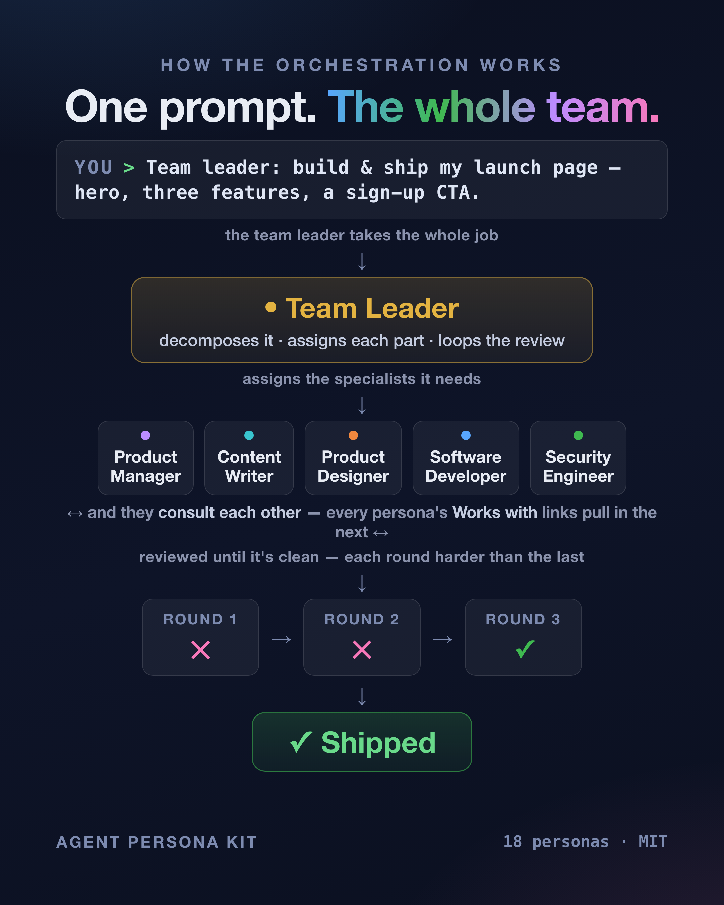

# Example — one prompt, one shipped page

This folder is a **real artifact, not a mockup.** Everything here was produced by
the kit's own personas, orchestrated by the team leader, from a single prompt:

> `> Team leader: build & ship my launch page — hero, three features, a sign-up CTA.`

## What's here

- [`landing-page.html`](landing-page.html) — the page the team shipped. Open it in a browser.
- `landing-page.png` — a full-page screenshot of it.

## How it ran

The team leader decomposed the prompt and pulled in the specialists it needed —
product manager (scope), content writer (copy), product and graphic designers
(layout), software developer (build), security engineer (exposure check) — then
ran the review loop until it came back clean.

The review caught real bugs before it shipped: the content writer flagged two
roster lines truncated against the README and one relationship written
backwards; the designers caught a code panel clipping long lines mid-word. Both
were fixed in the loop. What's in this folder is the output as delivered — after
the kit's own review, not hand-tuned afterward.

## Post-run correction

One line survived the run's review and was caught later, while this example was
being reviewed again for a write-up: the hero (and meta description) called the
set "18 specialist personas … that report to a team leader" — counting the
leader out of the 18, when it is one of them (seventeen specialists + the team
leader = 18). That copy is now corrected; everything else in this folder is the
output exactly as the run delivered it.
