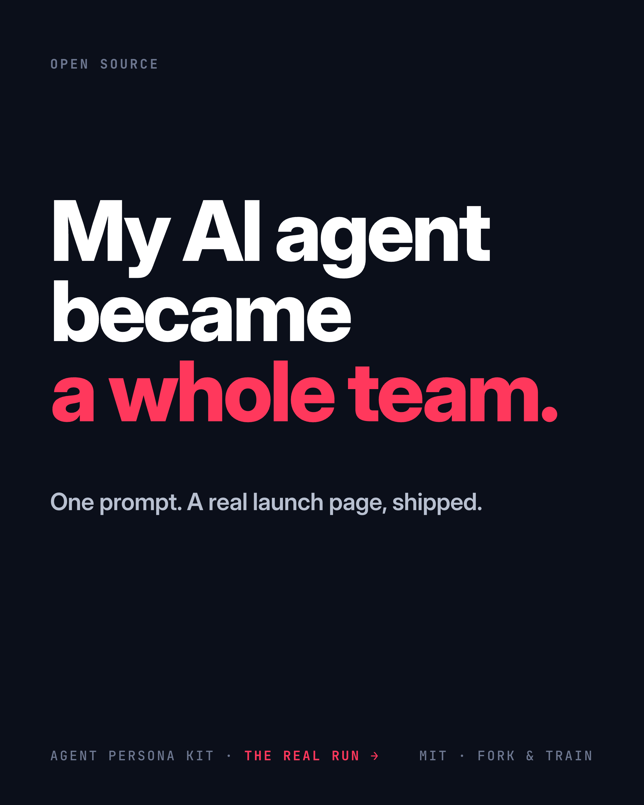
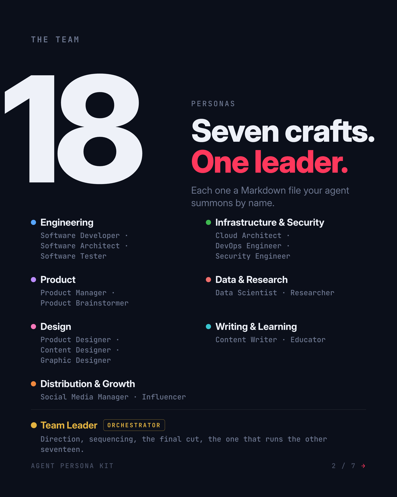

# Launch carousel

The LinkedIn carousel that markets Agent Persona Kit — seven slides that walk
through one real run: a single prompt handed to the team leader, the specialists
it pulled in, the launch page it shipped, and the bugs its own review caught
before shipping.

## What's here

| File | What it is |
|---|---|
| `carousel.pdf` | The deliverable — upload as a LinkedIn document post. |
| `carousel.html` | Source of the deck (one `.slide` per page, 1080×1350). |
| `landing-hero.png` | The real shipped launch page, embedded on slide 5. |
| `slides/slide-1.png` … `slide-7.png` | Rendered slides, for a quick look without opening the PDF. |
| `post.md` | The caption that goes with the carousel. |

## The deck




Slides, in order: cover · the 18-persona roster · the one prompt · how it runs
(team leader → six specialists → review loop → shipped) · the page it shipped
(real screenshot) · the bugs it caught · fork-and-train CTA. The remaining
slides are in `slides/`.

## Rebuilding it

The deck is plain HTML rendered with headless Chrome. It uses two fonts by
family name — **Inter** and **JetBrains Mono** — so both must be installed
locally (headless Chrome matches by family; without them it falls back and the
layout drifts).

```sh
# PDF (the deliverable)
chrome --headless --print-to-pdf=carousel.pdf carousel.html

# one slide as a PNG — the #sN hash selects the Nth slide in visual order
chrome --headless --force-device-scale-factor=2 --window-size=1080,1350 \
  --screenshot=slides/slide-1.png 'carousel.html#s1'
```

## Design system

- **Canvas** 1080×1350 portrait, flat `#0B0F1A` background — no gradients
  except the craft-family color coding in the roster and diagram, where color
  encodes a real distinction.
- **Type** two faces only: Inter (display) and JetBrains Mono (kickers,
  terminals, captions, page numbers).
- **Grid** left margin at 84px, 912px content width, titles flush-left with a
  ragged right edge; one accent (`#FF385C`) per slide plus green for
  pass/shipped status.
- **One idea per slide**, headlines that read as a running story when taken in
  order, and a dominant element on each slide that survives thumbnail scale.
